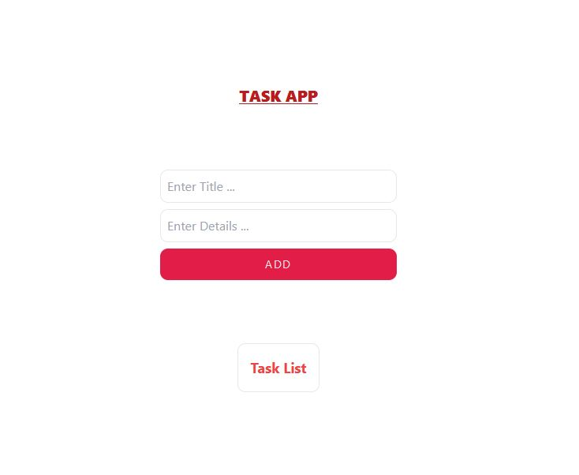
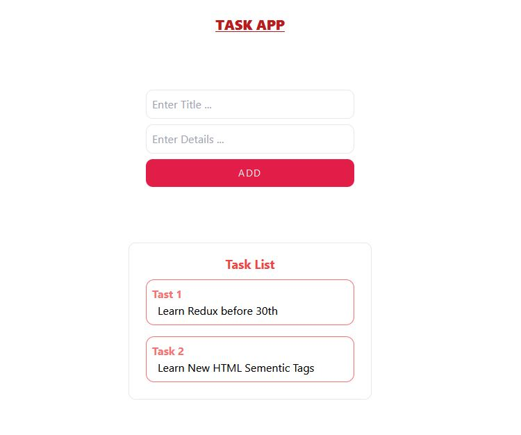

<h1 align="center" style="font-weight: bold;">My Task 💻</h1>

<p align="center">
<div align="center">
<!--  -->

</div>
<div align="center">



</div>
<p align="center">
<a href="https://github.com/ShaanCoding">📱 Visit this Project</a>
</p>

[](https://img.shields.io/github/v/release/navendu-pottekkat/awesome-readme?include_prereleases)
[](https://img.shields.io/github/last-commit/navendu-pottekkat/awesome-readme)
[](https://img.shields.io/github/issues-raw/navendu-pottekkat/awesome-readme)
[](https://img.shields.io/github/issues-pr/navendu-pottekkat/awesome-readme)
[](https://img.shields.io/github/license/navendu-pottekkat/awesome-readme)

<h2 id="technologies">💻 Technologies</h2>

- react
- tailwind CSS
- typescript

<h2 id="started">🚀 Getting started</h2>

Here you describe how to run your project locally

<h3>Prerequisites</h3>

Here you list all prerequisites necessary for running your project. For example:

- [NodeJS](https://github.com/)
- [Git](https://github.com)
- [typescript](https://www.typescriptlang.org/)
- [React](https://react.dev/learn)
- [tailwindcss](https://tailwindcss.com/)

<h3>Cloning</h3>

How to clone your project

```bash
git clone https://github.com/AlNomanCSE/task-app-typeScript.git
```
